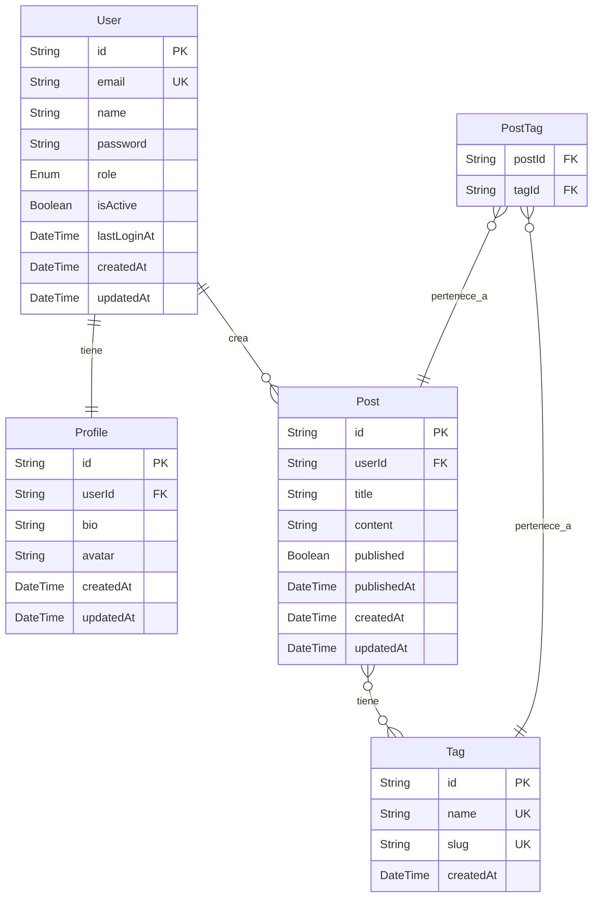

# Plantilla de Documentación del Modelo de Datos

## Propósito de este Documento

Este documento sirve como **plantilla** para crear la documentación del modelo de datos de tu proyecto. Debes personalizarlo según las necesidades específicas de tu aplicación.

---

## Instrucciones de Uso

1. **Copia esta plantilla** y renómbrala a `data-model.md` en tu proyecto
2. **Reemplaza los placeholders** (texto entre corchetes `[...]`) con información específica de tu proyecto
3. **Elimina las entidades de ejemplo** y agrega las tuyas
4. **Actualiza el diagrama ER** con tus entidades y relaciones
5. **Mantén este documento sincronizado** con tu `schema.prisma`

---

## Estructura Recomendada

### Información del Proyecto

**Nombre del Proyecto**: [Nombre de tu aplicación]
**Descripción**: [Breve descripción del propósito del sistema]
**Base de Datos**: [PostgreSQL / MySQL / SQLite / etc.]
**ORM**: [Prisma / TypeORM / Drizzle / etc.]

---

## Descripciones de los Modelos

Para cada entidad/modelo en tu sistema, documenta lo siguiente:

### [Nombre de la Entidad]

**Descripción**: [Qué representa esta entidad en tu sistema]

**Campos**:
- `id`: [Tipo] - [Descripción] (Clave Primaria)
- `[campo1]`: [Tipo] - [Descripción] [Obligatorio/Opcional]
- `[campo2]`: [Tipo] - [Descripción] [Obligatorio/Opcional]
- `createdAt`: DateTime - Fecha de creación (generada automáticamente)
- `updatedAt`: DateTime - Fecha de última actualización (generada automáticamente)

**Reglas de Validación**:
- [Regla 1]: [Descripción de la validación]
- [Regla 2]: [Descripción de la validación]
- [Restricciones únicas]: [Campos que deben ser únicos]

**Relaciones**:
- `[relación1]`: [Tipo de relación] con [Entidad relacionada] - [Descripción]
- `[relación2]`: [Tipo de relación] con [Entidad relacionada] - [Descripción]

**Índices**:
- [Campo(s) indexado(s)]: [Razón del índice]

---

## Ejemplo de Entidad Documentada

### User (Usuario)

**Descripción**: Representa un usuario registrado en el sistema con capacidad de autenticación.

**Campos**:
- `id`: String (UUID) - Identificador único del usuario (Clave Primaria)
- `email`: String - Dirección de correo electrónico (Obligatorio, Único)
- `name`: String - Nombre completo del usuario (Obligatorio)
- `password`: String - Contraseña hasheada (Obligatorio)
- `role`: Enum - Rol del usuario: ADMIN, USER, GUEST (Obligatorio, default: USER)
- `isActive`: Boolean - Indica si la cuenta está activa (Obligatorio, default: true)
- `lastLoginAt`: DateTime - Última fecha de login (Opcional)
- `createdAt`: DateTime - Fecha de creación
- `updatedAt`: DateTime - Fecha de actualización

**Reglas de Validación**:
- Email debe ser único en el sistema
- Email debe tener formato válido
- Contraseña debe tener mínimo 8 caracteres
- Nombre debe tener entre 2 y 100 caracteres

**Relaciones**:
- `posts`: Relación uno-a-muchos con Post (un usuario puede tener muchos posts)
- `profile`: Relación uno-a-uno con Profile (un usuario tiene un perfil)

**Índices**:
- `email`: Para búsquedas rápidas por email durante login
- `role, isActive`: Para filtrar usuarios activos por rol

---

## Tipos de Relaciones

Documenta cómo se relacionan tus entidades:

### Uno a Uno (1:1)
**Ejemplo**: User ←→ Profile
- Un usuario tiene exactamente un perfil
- Un perfil pertenece a exactamente un usuario

### Uno a Muchos (1:N)
**Ejemplo**: User → Posts
- Un usuario puede tener muchos posts
- Un post pertenece a un solo usuario

### Muchos a Muchos (N:M)
**Ejemplo**: Posts ←→ Tags
- Un post puede tener muchos tags
- Un tag puede estar en muchos posts
- Requiere tabla intermedia (PostTags)

---

## Diagrama Entidad-Relación

Utiliza Mermaid para crear un diagrama visual de tu modelo de datos:



---

## Principios de Diseño del Modelo

Documenta las decisiones de diseño y principios aplicados:

### 1. Normalización
- **Nivel de normalización**: [3NF / BCNF / Denormalizado parcialmente]
- **Razón**: [Por qué elegiste este nivel]

### 2. Integridad Referencial
- Todas las claves foráneas tienen restricciones `onDelete` y `onUpdate` definidas
- [Estrategias usadas]: CASCADE, SET NULL, RESTRICT, etc.

### 3. Auditoría
- Campos `createdAt` y `updatedAt` en todas las entidades
- [Otros campos de auditoría]: createdBy, updatedBy, deletedAt (soft delete)

### 4. Flexibilidad
- [Decisiones que permiten evolución del modelo]

### 5. Performance
- [Índices estratégicos]
- [Denormalizaciones justificadas]

---

## Enums y Tipos Personalizados

Documenta todos los enums y tipos personalizados:

### UserRole
```typescript
enum UserRole {
  ADMIN   = "ADMIN"   // Administrador del sistema
  USER    = "USER"    // Usuario regular
  GUEST   = "GUEST"   // Usuario invitado (lectura)
}
```

### [Otro Enum]
```typescript
enum [NombreEnum] {
  [VALOR1] = "[valor1]"  // Descripción
  [VALOR2] = "[valor2]"  // Descripción
}
```

---

## Migraciones y Versionado

Documenta la estrategia de migraciones:

- **Herramienta**: [Prisma Migrate / TypeORM Migrations / etc.]
- **Estrategia**: [Cómo se manejan los cambios de esquema]
- **Ambiente de desarrollo**: [Cómo aplicar migraciones]
- **Ambiente de producción**: [Proceso de deploy de migraciones]

---

## Consideraciones de Seguridad

- **Datos sensibles**: [Qué datos se encriptan y cómo]
- **PII (Información Personal Identificable)**: [Cómo se protege]
- **Cumplimiento**: [GDPR, CCPA, u otras regulaciones aplicables]

---

## Notas Adicionales

- [Cualquier consideración especial sobre el modelo de datos]
- [Limitaciones conocidas]
- [Planes futuros de evolución del esquema]

---

## Referencias

- [Schema de Prisma]: `prisma/schema.prisma`
- [Migraciones]: `prisma/migrations/`
- [Seeds]: `prisma/seed.ts`

---

## Ejemplo Completo

Para ver un ejemplo completo de esta plantilla aplicada a un proyecto real, consulta:
**[Sistema LTI ATS](../examples/lti-ats/data-model.md)** - Sistema de seguimiento de candidatos

---

**Última Actualización**: [Fecha]
**Versión del Modelo**: [x.x.x]
**Mantenido por**: [Equipo/Persona responsable]
