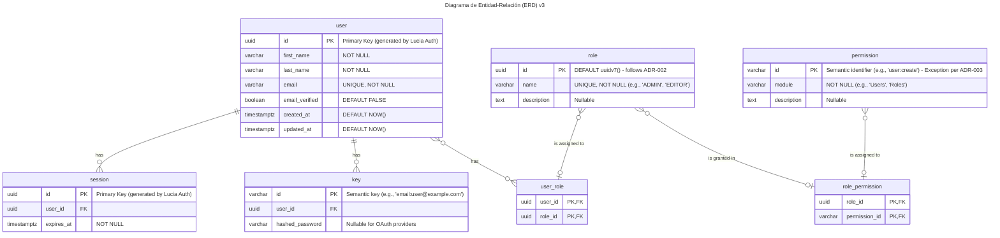

```mermaid
---
title: Diagrama de Entidad-Relación (ERD) v3
---
erDiagram
    user {
        uuid id PK "Primary Key (generated by Lucia Auth)"
        varchar first_name "NOT NULL"
        varchar last_name "NOT NULL"
        varchar email "UNIQUE, NOT NULL"
        boolean email_verified "DEFAULT FALSE"
        timestamptz created_at "DEFAULT NOW()"
        timestamptz updated_at "DEFAULT NOW()"
    }

    session {
        uuid id PK "Primary Key (generated by Lucia Auth)"
        uuid user_id FK
        timestamptz expires_at "NOT NULL"
    }

    key {
        varchar id PK "Semantic key (e.g., 'email:user@example.com')"
        uuid user_id FK
        varchar hashed_password "Nullable for OAuth providers"
    }

    role {
        uuid id PK "DEFAULT uuidv7() - follows ADR-002"
        varchar name "UNIQUE, NOT NULL (e.g., 'ADMIN', 'EDITOR')"
        text description "Nullable"
    }

    permission {
        varchar id PK "Semantic identifier (e.g., 'user:create') - Exception per ADR-003"
        varchar module "NOT NULL (e.g., 'Users', 'Roles')"
        text description "Nullable"
    }

    user_role {
        uuid user_id PK, FK
        uuid role_id PK, FK
    }

    role_permission {
        uuid role_id PK, FK
        varchar permission_id PK, FK
    }

    user ||--o{ session : "has"
    user ||--o{ key : "has"
    user }o--o{ user_role : "has"
    role }o--o| user_role : "is assigned to"
    role }o--o| role_permission : "is granted in"
    permission }o--o| role_permission : "is assigned to"

```