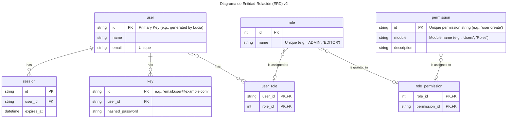

```mermaid
---
title: Diagrama de Entidad-Relación (ERD) v2
---
erDiagram
    user {
        string id PK "Primary Key (e.g., generated by Lucia)"
        string name
        string email "Unique"
    }

    session {
        string id PK
        string user_id FK
        datetime expires_at
    }

    key {
        string id PK "e.g., 'email:user@example.com'"
        string user_id FK
        string hashed_password
    }

    role {
        int id PK
        string name "Unique (e.g., 'ADMIN', 'EDITOR')"
    }

    permission {
        string id PK "Unique permission string (e.g., 'user:create')"
        string module "Module name (e.g., 'Users', 'Roles')"
        string description
    }

    user_role {
        string user_id PK, FK
        int role_id PK, FK
    }
    
    role_permission {
        int role_id PK, FK
        string permission_id PK, FK
    }

    user ||--o{ session : "has"
    user ||--o{ key : "has"
    user }o--o{ user_role : "has"
    role }o--o| user_role : "is assigned to"
    role }o--o| role_permission : "is granted in"
    permission }o--o| role_permission : "is assigned to"

```