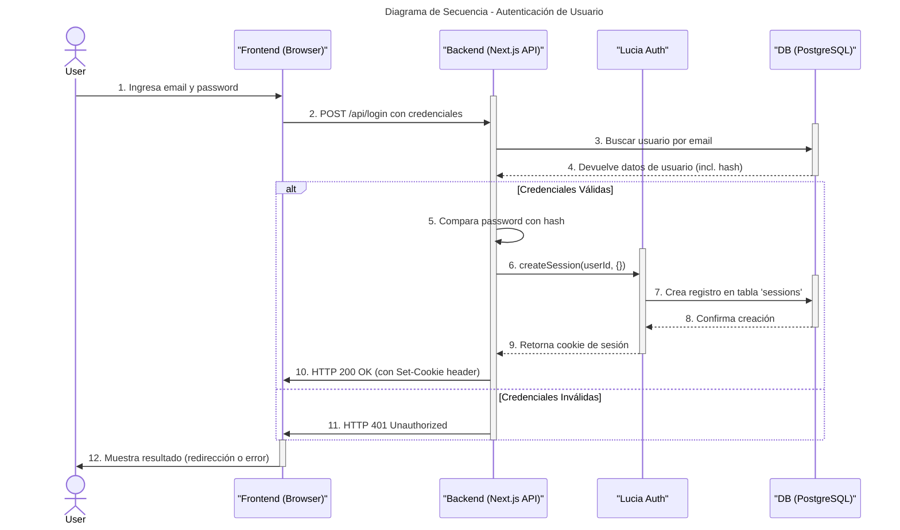

```mermaid
---
title: Diagrama de Secuencia - Autenticación de Usuario
---
sequenceDiagram
    actor User
    participant Frontend as "Frontend (Browser)"
    participant Backend as "Backend (Next.js API)"
    participant Lucia as "Lucia Auth"
    participant DB as "DB (PostgreSQL)"

    User->>Frontend: 1. Ingresa email y password
    
    activate Backend
    Frontend->>Backend: 2. POST /api/login con credenciales
    
    activate DB
    Backend->>DB: 3. Buscar usuario por email
    DB-->>Backend: 4. Devuelve datos de usuario (incl. hash)
    deactivate DB
    
    alt Credenciales Válidas
        Backend->>Backend: 5. Compara password con hash
        
        activate Lucia
        Backend->>Lucia: 6. createSession(userId, {})
        
        activate DB
        Lucia->>DB: 7. Crea registro en tabla 'sessions'
        DB-->>Lucia: 8. Confirma creación
        deactivate DB
        
        Lucia-->>Backend: 9. Retorna cookie de sesión
        deactivate Lucia
        
        Backend->>Frontend: 10. HTTP 200 OK (con Set-Cookie header)
    else Credenciales Inválidas
        Backend->>Frontend: 11. HTTP 401 Unauthorized
    end
    
    deactivate Backend
    
    activate Frontend
    Frontend->>User: 12. Muestra resultado (redirección o error)
    deactivate Frontend
```